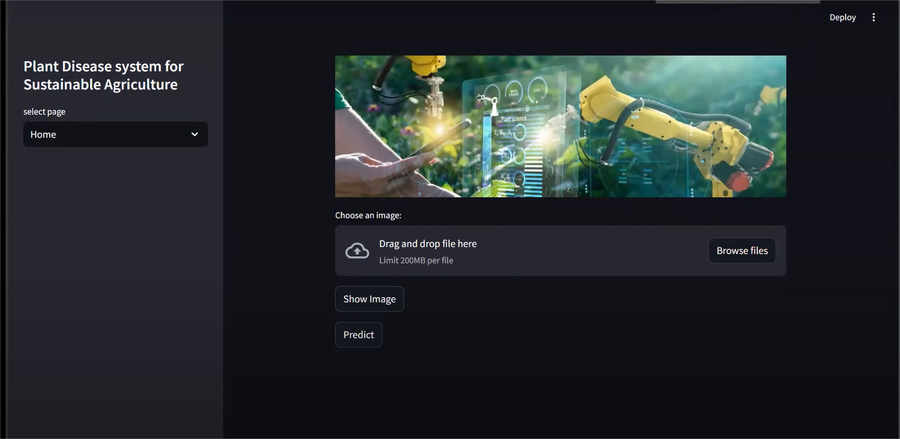
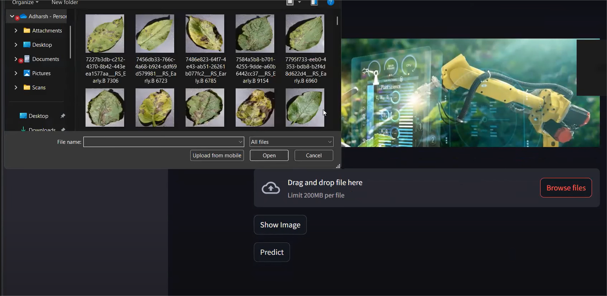
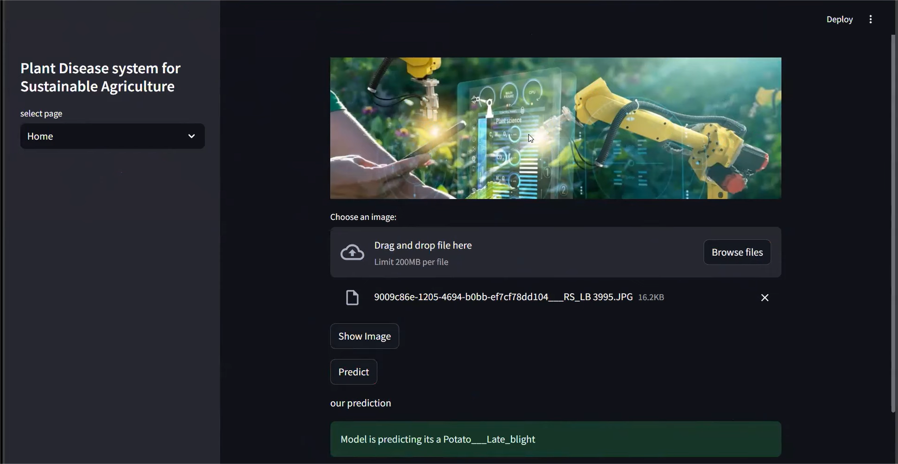
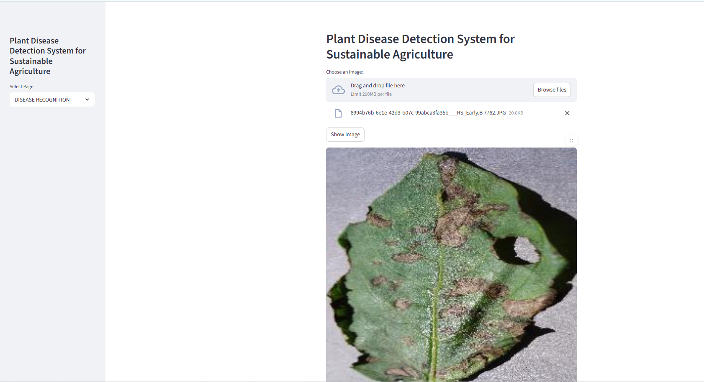
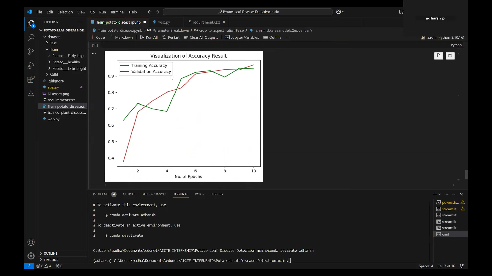

# potato_Leaf_Disease_Detection

## 🧠 The Story Behind This Project

Agriculture plays a vital role in many countries, and crop diseases can significantly affect food production and farmers’ income. One of the common crops affected by plant diseases is the potato plant.

Detecting diseases in potato leaves at an early stage is important to prevent the spread of infection and reduce crop loss. However, manual detection of plant diseases requires expert knowledge and can be time-consuming.

This project focuses on building a deep learning model that can automatically detect potato leaf diseases using image classification techniques. By analyzing leaf images, the system can identify whether a leaf is healthy or affected by disease.

This project demonstrates how artificial intelligence and deep learning can help farmers detect plant diseases quickly and accurately.

---

## 🔍 Project Objective

The main objective of this project is to develop a system that can detect potato leaf diseases using deep learning techniques and image processing.

The system aims to:
- Identify healthy and diseased potato leaves
- Classify different types of potato diseases
- Assist farmers in early disease detection
- Reduce crop damage by timely treatment

---

## 📂 Dataset

The dataset used in this project contains images of potato leaves categorized into different classes:

- Healthy
- Early Blight
- Late Blight

The images were used to train and test the deep learning model for accurate disease detection.

---

## ⚙️ Methodology

The system follows the following steps:

1. **Data Collection**  
   Collect potato leaf images from a plant disease dataset.

2. **Data Preprocessing**  
   Resize and normalize images for model training.

3. **Model Training**  
   Train a convolutional neural network (CNN) model to classify leaf images.

4. **Model Evaluation**  
   Evaluate the model performance using test images.

5. **Prediction**  
   The trained model predicts whether the leaf is healthy or affected by disease.

---

## 🛠 Tools & Technologies Used

- Python
- TensorFlow / Keras
- Deep Learning (CNN)
- Image Processing
- Jupyter Notebook / Python Environment

---

## 📊 Project Workflow

Dataset → Image Preprocessing → Model Training → Model Evaluation → Disease Prediction

---
## 📸 Project Screenshots

### 🏠 Dashboard Home

### 🧪 Testing the Model

### 🔍 Predicting Output

### 🖼 Showing Image Input

### 📊 Model Accuracy

---

## 📈 Results

The trained model successfully classifies potato leaf images into different categories such as healthy, early blight, and late blight. The system demonstrates how deep learning can be applied in agriculture for early detection of plant diseases.

---

## 📚 What I Learned From This Project

Through this project I learned:

- How deep learning models work for image classification
- How to preprocess image datasets
- How to train CNN models using TensorFlow/Keras
- How artificial intelligence can be applied in agriculture

This project helped me gain practical knowledge in **machine learning and computer vision**.

---

## 🚀 Future Scope

The project can be improved by:

- Using larger and more diverse datasets
- Increasing model accuracy with advanced deep learning models
- Developing a mobile application for farmers
- Implementing real-time disease detection using a camera

---

## 💬 Feedback

If you have any suggestions or improvements for this project, feel free to share your feedback.

---

## 👩‍💻 Author

**Ujjuri Saisri**  
B.Tech – Computer Science Engineering  
Aspiring Data Analyst / Developer
